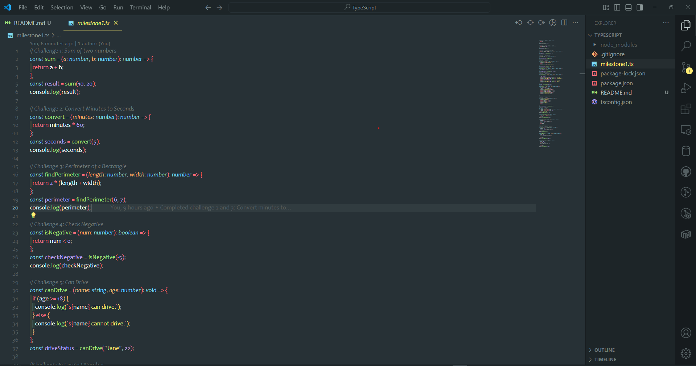

# TypeScript Functions Practice

This repository contains of TypeScript functions that solve various problems. It covers concepts like arithmetic, conditions, loops and mathematical calculations.

Example:



> This codes will solve the problems as in the comments.

## How to Impliment the Codes

1. Clone the repository
1. Open the milestone1.ts
1. Download the required packages to run the codes.

Running:

```bash
ts-node milestone1.ts
```
